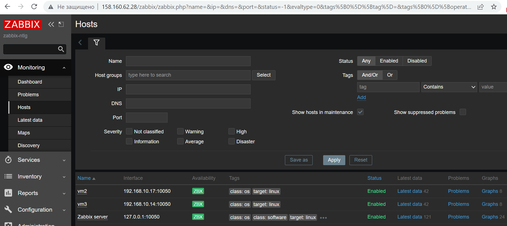

# 9.2. Система мониторинга Zabbix - Кулагин Игорь
## Задание 1
>Установите Zabbix Server с веб-интерфейсом.
>Прикрепите в файл README.md скриншот авторизации в админке


---


>Приложите в файл README.md текст использованных команд в GitHub

**Не совсем понятно, что имеется ввиду.**
- Вот список использованных комaнд для git:
```
 git add .
 git commit -m 'add 9.1 info'
 git push origin
```
- Вот список использованных комaнд для установки сервера Zabbix:
```
sudo apt update && sudo apt upgrade -y

#Добавляем репозиторий Zabbix 6.0
wget https://repo.zabbix.com/zabbix/6.0/ubuntu/pool/main/z/zabbix-release/zabbix-release_6.0-4+ubuntu22.04_all.deb
sudo dpkg -i zabbix-release_6.0-4+ubuntu22.04_all.deb
sudo apt update

#Устанавливаем необходимые пакеты
sudo apt install zabbix-server-pgsql zabbix-frontend-php php8.1-pgsql zabbix-apache-conf zabbix-sql-scripts zabbix-agent postgresql -y

#Создаем пользователя, задаем ему пароль, создаем БД задаем zabbix ее владельцем
sudo -u postgres createuser --pwprompt zabbix
sudo -u postgres createdb -O zabbix zabbix

#Развертываем схему БД и шаблон
zcat /usr/share/zabbix-sql-scripts/postgresql/server.sql.gz | sudo -u zabbix psql zabbix

#Задаем пароль для соединения с СУБД 
sudo sed -i 's+# DBPassword=+DBPassword=MyPa$sw0rd@2+g' /etc/zabbix/zabbix_server.conf

sudo systemctl restart zabbix-server zabbix-agent apache2
sudo systemctl enable zabbix-server zabbix-agent apache2
```
## Задание 2
>Приложите в файл README.md скриншот раздела Configuration > Hosts, где видно, что агенты подключены к серверу


---
>Приложите в файл README.md скриншот лога zabbix agent, где видно, что он работает с сервером


На скрине выше не очень видно, что агент взаимодействует с сервером, поэтому ниже скрин лога сервера: 
---


>Приложите в файл README.md скриншот раздела Monitoring > Latest data для обоих хостов, где видны поступающие от агентов данные.


>Приложите в файл README.md текст использованных команд в GitHub

**Не совсем понятно, что имеется ввиду.**
- Вот список использованных комaнд для git:
```
 git add .
 git commit -m 'add 9.2 info'
 git push origin
```
- Вот список использованных комaнд для настройки агентов:

```
sudo apt install zabbix-agent -y
sudo sed -i 's+Server=127.0.0.1+Server=192.168.10.31+g' /etc/zabbix/zabbix_agentd.conf
sudo service zabbix-agent restart

