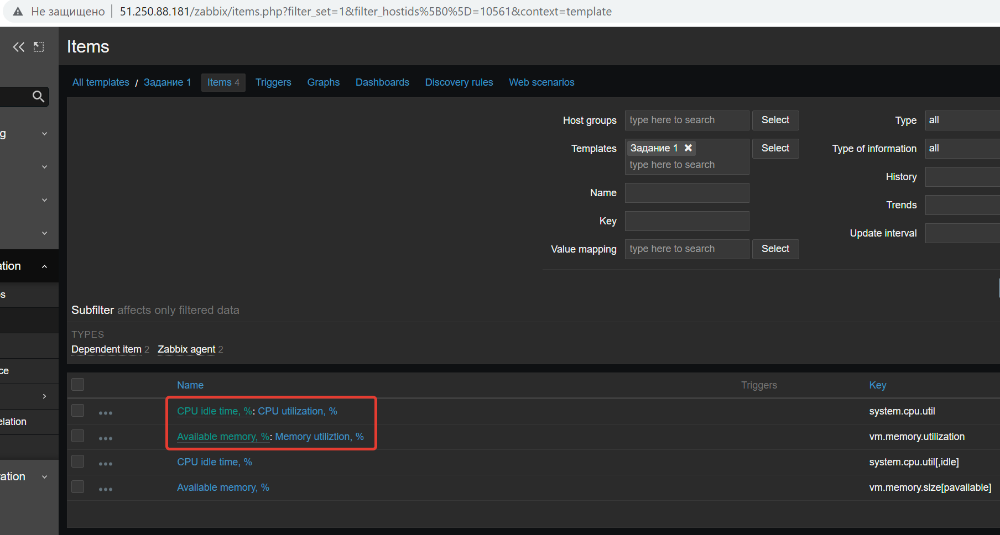

# 9.2. Система мониторинга Zabbix. Часть 2 - Кулагин Игорь
## Задание 1
>Создайте свой шаблон, в котором будут элементы данных, мониторящие загрузку CPU и RAM хоста.
>Прикрепите в файл README.md скриншот страницы шаблона с названием «Задание 1»

## Задание 2
>Прикрепите за каждым хостом шаблон Linux by Zabbix Agent

>Проверьте что в разделе Latest Data начали появляться данные с добавленных агентов

>Результат данного задания сдавайте вместе с заданием 3

`¯\_(ツ)_/¯`

## Задание 3
>Зайдите в настройки каждого хоста и в разделе Templates прикрепите к этому хосту ваш шаблон

>Так же к каждому хосту привяжите шаблон Linux by Zabbix Agent

> Проверьте что в раздел Latest Data начали поступать необходимые данные из вашего шаблона

>Прикрепите в файл README.md скриншот страницы хостов, где будут видны привязки шаблонов с названиями «Задание 2-3». Хосты должны иметь зелёный статус подключения

## Задание 4
>Создайте свой кастомный дашборд.

>Прикрепите в файл README.md скриншот дашборда с названием «Задание 4»

